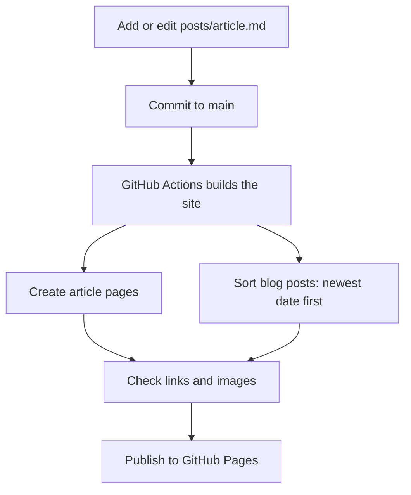

Write your opening paragraph here.

## A section heading

Add more paragraphs, **bold text**, or a list:

- Your first point
- Your second point


test

## Az VPN

```shell
RG="lab-charles-rg"
LOCATION="uksouth"

VNET="vnet-main"
VNET_PREFIX="10.10.0.0/16"

# Azure requires the subnet to be named exactly GatewaySubnet
GW_SUBNET_PREFIX="10.10.255.0/27"

GW_PIP="pip-vpn-gateway"
GW_NAME="vng-basic"

# On-premises VPN device and reachable prefixes
ONPREM_NAME="lng-onprem"
ONPREM_PUBLIC_IP="203.0.113.10"
ONPREM_PREFIX="10.34.0.0/16"

CONNECTION_NAME="conn-onprem"
PSK="Replace-With-A-Strong-PreShared-Key"
```
