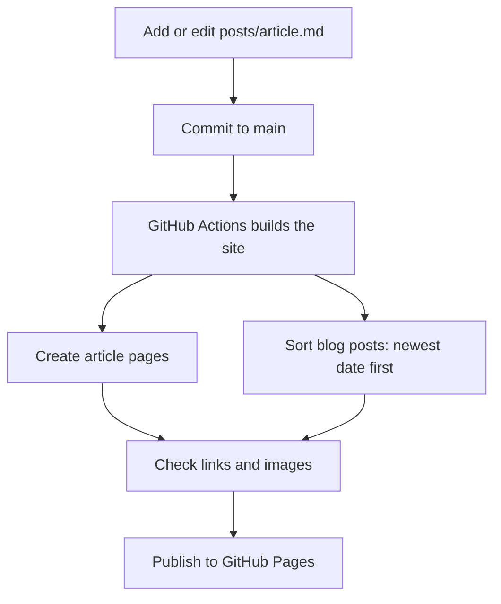

Write your opening paragraph here.

## A section heading

Add more paragraphs, **bold text**, or a list:

- Your first point
- Your second point

```mermaid
flowchart TD
    A["Add or edit posts/article.md"] --> B["Commit to main"]
    B --> C["GitHub Actions builds the site"]
    C --> D["Create article pages"]
    C --> E["Sort blog posts: newest date first"]
    D --> F["Check links and images"]
    E --> F
    F --> G["Publish to GitHub Pages"]
```
test
